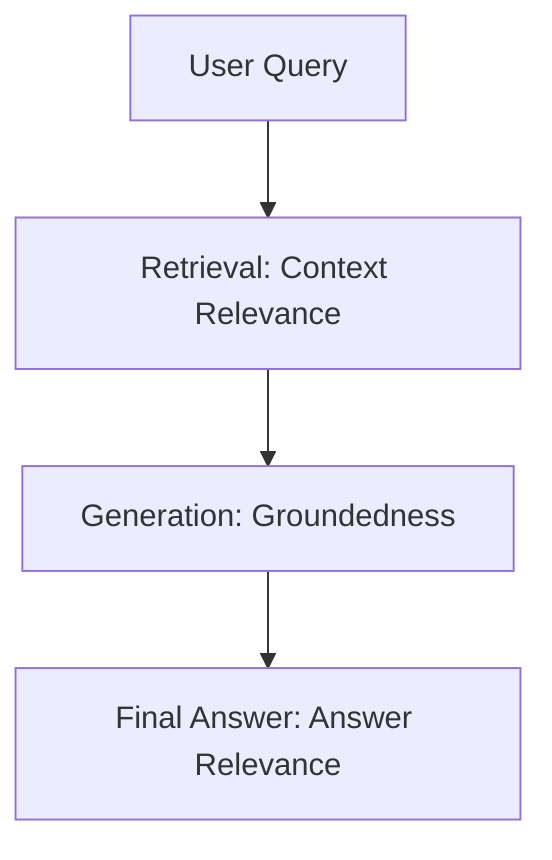

# 🧭 **RAG Evaluation Cheatsheet**

> *Measure, diagnose, and improve Retrieval-Augmented Generation (RAG) performance with [TruLens](https://www.trulens.org/).*

---

## ⚙️ **The 3 Core Metrics**

| Metric | Checks | Nickname |
|--------|---------|-----------|
| **Groundedness** | Are all answers based on retrieved data? | *Hallucination Detector* |
| **Context Relevance** | Did we retrieve the *right* data? | *Retriever Health Check* |
| **Answer Relevance** | Did we answer the *actual* question? | *Response Quality Check* |

---

## 🧠 **1. Groundedness (Faithfulness) — “The Hallucination Detector”**

**Definition:**  
Measures whether the generated answer is *factually supported* by the retrieved context — no hallucinations or made-up facts.

### 🧩 **Example**

**Context Retrieved:**  
> “The Eiffel Tower was completed in 1889 and stands 330 meters tall.”

✅ **Good (Grounded):**  
> “The Eiffel Tower is 330 meters tall.”

❌ **Bad (Not Grounded):**  
> “The Eiffel Tower is 330 meters tall and was designed by Gustave Eiffel in collaboration with Leonardo da Vinci.”

**Why Bad:**  
Hallucinates information not supported by the context.

---

## 🔍 **2. Context Relevance (Retrieval Quality) — “Right Data, Right Answer”**

**Definition:**  
Measures whether the retrieved documents or chunks actually contain *information relevant* to answering the user’s question.

### 🧩 **Example**

**User Question:**  
> “What are the health benefits of green tea?”

✅ **Good (Relevant Context):**  
- “Green tea contains antioxidants called catechins that may reduce inflammation.”  
- “Studies show green tea consumption is associated with lower cardiovascular disease risk.”

❌ **Bad (Irrelevant Context):**  
- “The tea ceremony in Japan dates back to the 9th century.”  
- “Green tea is grown primarily in China, Japan, and India.”

**Why Bad:**  
These contexts don’t help answer the question about health benefits.

---

## 💬 **3. Answer Relevance (Response Quality) — “On Topic or Not?”**

**Definition:**  
Measures whether the generated answer actually *addresses the user’s question* clearly and directly.

### 🧩 **Example**

**User Question:**  
> “How do I reset my password?”

✅ **Good (Relevant Answer):**  
> “To reset your password, click ‘Forgot Password’ on the login page, enter your email, and follow the link sent to your inbox.”

❌ **Bad (Irrelevant Answer):**  
> “Passwords are important for security. Strong passwords should contain uppercase, lowercase, numbers, and symbols.”

**Why Bad:**  
Talks about passwords generally but doesn’t answer *how to reset* it.

---

## 🔄 **How the Three Metrics Work Together**

Each stage builds on the previous:
- **Context Relevance** → Did we get the *right data*?  
- **Groundedness** → Is the answer *supported by that data*?  
- **Answer Relevance** → Does the response *actually answer* the question?

---

## 💼 **End-to-End Example**

**Query:**  
> “What is the refund policy for online orders?”

1. **Retrieval:**  
   → “Online orders can be returned within 30 days for a full refund.”  
   ✅ *High Context Relevance*

2. **Generation:**  
   → “You can get a full refund if you return within 30 days.”  
   ✅ *High Groundedness*

3. **Final Answer:**  
   → Directly answers the refund question.  
   ✅ *High Answer Relevance*

**Result:**  
All three metrics high → **High-quality RAG response!**

---

## 🪜 **Fix Order: Context → Groundedness → Answer**

> **Bad retrieval breaks everything downstream.**
> 
> Good RAG = ✅ Right Data (Context Relevance) + 🧠 No Hallucinations (Groundedness) + 💬 On Topic (Answer Relevance)

---

## 📊 **Scoring Quick View**

| Metric | 🟢 Ship It | 🟡 Tune It | 🟠 Fix It | 🔴 Stop |
|--------|------------|-----------|-----------|---------|
| **Groundedness** | 0.90–1.0 | 0.70–0.89 | 0.50–0.69 | <0.50 |
| **Context Relevance** | 0.80–1.0 | 0.60–0.79 | 0.40–0.59 | <0.40 |
| **Answer Relevance** | 0.90–1.0 | 0.70–0.89 | 0.50–0.69 | <0.50 |

> ⚖️ **Note:** Thresholds should be set *case-by-case* based on your application’s goals and tolerance for error.

---

## ⚡️ **Quick Wins**

**If Groundedness is low:**  
→ Add to prompt: *“Base your answer ONLY on the provided context. If unsure, say ‘I don't have enough information.’”*

**If Context Relevance is low:**  
→ Improve retrieval configuration, embedding quality, or metadata filtering to return more relevant context.

**If Answer Relevance is low:**  
→ Add to prompt: *“Answer the question directly and concisely. Stay focused on what was asked.”*

---

## 💡 **Rules of Thumb**

1. **You can’t improve what you don’t measure.**  
2. **Fix retrieval first** — garbage in = garbage out.  
3. **All three must be high** for reliable RAG evaluation.  
4. **Monitor continuously** — data and model drift can affect scores.

---

## 🧩 **Common Score Patterns**

| Pattern | Meaning | Fix |
|----------|----------|-----|
| All high | ✅ Ready for prod | Deploy & monitor |
| All low | 💥 System broken | Debug fundamentals |
| Low context | 🔍 Retrieval issue | Tune embeddings or search |
| Low groundedness | 🤥 Hallucination | Add stricter prompts |
| Low answer | 📝 Prompting | Simplify and focus |

---

## 🧭 **Readiness Checklist**

- [ ] Metrics meet internal thresholds  
- [ ] Tested on diverse queries  
- [ ] Monitoring and alerts in place  
- [ ] Escalation path defined  
- [ ] Baseline metrics tracked  

---

**Evaluate your RAG system with confidence — measure retrieval quality, factual grounding, and response accuracy using [TruLens](https://www.trulens.org/).**

