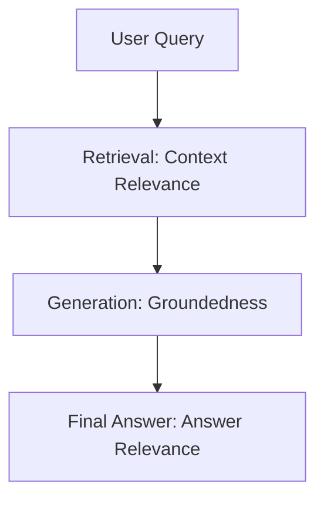

---
authors:
  - Kamesh Sampath <kamesh.sampath@snowflake.com>
date: "2026-06-07"
version: "1.0"
tags: [rag, llm-evaluation, trulens, snowflake, ai, prompt-engineering]
---

# RAG Evaluation — Developer Cheatsheet

Measure, diagnose, and improve Retrieval-Augmented Generation (RAG) performance
using the three core evaluation metrics with [TruLens](https://www.trulens.org/).

> [!IMPORTANT]
> Community cheatsheet — not official Snowflake documentation.
> For the authoritative reference, see
> [TruLens documentation](https://www.trulens.org/docs/).

## Table of Contents

- [The 3 Core Metrics](#the-3-core-metrics)
- [1. Groundedness](#1-groundedness)
- [2. Context Relevance](#2-context-relevance)
- [3. Answer Relevance](#3-answer-relevance)
- [How the Three Metrics Work Together](#how-the-three-metrics-work-together)
- [End-to-End Example](#end-to-end-example)
- [Fix Order](#fix-order)
- [Scoring Quick View](#scoring-quick-view)
- [Quick Wins](#quick-wins)
- [Rules of Thumb](#rules-of-thumb)
- [Common Score Patterns](#common-score-patterns)
- [Readiness Checklist](#readiness-checklist)
- [References](#references)

## The 3 Core Metrics

| Metric | Checks | Nickname |
| --- | --- | --- |
| **Groundedness** | Are all answers based on retrieved data? | Hallucination Detector |
| **Context Relevance** | Did we retrieve the right data? | Retriever Health Check |
| **Answer Relevance** | Did we answer the actual question? | Response Quality Check |

## 1. Groundedness

Measures whether the generated answer is factually supported by the retrieved context —
no hallucinations or made-up facts.

### Example

Context retrieved:

> "The Eiffel Tower was completed in 1889 and stands 330 meters tall."

Good (grounded):

> "The Eiffel Tower is 330 meters tall."

Bad (not grounded):

> "The Eiffel Tower is 330 meters tall and was designed by Gustave Eiffel in
> collaboration with Leonardo da Vinci."

Why bad: hallucinates information not supported by the context.

## 2. Context Relevance

Measures whether the retrieved documents or chunks actually contain information
relevant to answering the user's question.

### Example

User question:

> "What are the health benefits of green tea?"

Good (relevant context):

- "Green tea contains antioxidants called catechins that may reduce inflammation."
- "Studies show green tea consumption is associated with lower cardiovascular disease risk."

Bad (irrelevant context):

- "The tea ceremony in Japan dates back to the 9th century."
- "Green tea is grown primarily in China, Japan, and India."

Why bad: these contexts don't help answer the question about health benefits.

## 3. Answer Relevance

Measures whether the generated answer actually addresses the user's question
clearly and directly.

### Example

User question:

> "How do I reset my password?"

Good (relevant answer):

> "To reset your password, click 'Forgot Password' on the login page, enter
> your email, and follow the link sent to your inbox."

Bad (irrelevant answer):

> "Passwords are important for security. Strong passwords should contain
> uppercase, lowercase, numbers, and symbols."

Why bad: talks about passwords generally but doesn't answer how to reset it.

## How the Three Metrics Work Together

```mermaid
graph TD
    A[User Query] --> B[Retrieval: Context Relevance]
    B --> C[Generation: Groundedness]
    C --> D[Final Answer: Answer Relevance]
```

Each stage builds on the previous:

- **Context Relevance:** Did we get the right data?
- **Groundedness:** Is the answer supported by that data?
- **Answer Relevance:** Does the response actually answer the question?

## End-to-End Example

Query:

> "What is the refund policy for online orders?"

1. **Retrieval:** "Online orders can be returned within 30 days for a full refund."
   — High Context Relevance
2. **Generation:** "You can get a full refund if you return within 30 days."
   — High Groundedness
3. **Final Answer:** Directly answers the refund question.
   — High Answer Relevance

All three metrics high = high-quality RAG response.

## Fix Order

> [!NOTE]
> Bad retrieval breaks everything downstream.
> Fix in order: Context Relevance first, then Groundedness, then Answer Relevance.

Good RAG = Right Data (Context Relevance) + No Hallucinations (Groundedness) +
On Topic (Answer Relevance).

## Scoring Quick View

| Metric | Ship It | Tune It | Fix It | Stop |
| --- | --- | --- | --- | --- |
| **Groundedness** | 0.90–1.0 | 0.70–0.89 | 0.50–0.69 | < 0.50 |
| **Context Relevance** | 0.80–1.0 | 0.60–0.79 | 0.40–0.59 | < 0.40 |
| **Answer Relevance** | 0.90–1.0 | 0.70–0.89 | 0.50–0.69 | < 0.50 |

> [!NOTE]
> Thresholds should be set case-by-case based on your application's goals
> and tolerance for error.

## Quick Wins

**If Groundedness is low:**
Add to prompt: *"Base your answer ONLY on the provided context. If unsure,
say 'I don't have enough information.'"*

**If Context Relevance is low:**
Improve retrieval configuration, embedding quality, or metadata filtering
to return more relevant context.

**If Answer Relevance is low:**
Add to prompt: *"Answer the question directly and concisely. Stay focused
on what was asked."*

## Rules of Thumb

1. **You can't improve what you don't measure.**
2. **Fix retrieval first** — garbage in = garbage out.
3. **All three must be high** for reliable RAG evaluation.
4. **Monitor continuously** — data and model drift can affect scores.

## Common Score Patterns

| Pattern | Meaning | Fix |
| --- | --- | --- |
| All high | Ready for production | Deploy and monitor |
| All low | System broken | Debug fundamentals |
| Low context | Retrieval issue | Tune embeddings or search |
| Low groundedness | Hallucination risk | Add stricter prompts |
| Low answer | Prompting issue | Simplify and focus |

## Readiness Checklist

- [ ] Metrics meet internal thresholds
- [ ] Tested on diverse queries
- [ ] Monitoring and alerts in place
- [ ] Escalation path defined
- [ ] Baseline metrics tracked

## References

- [TruLens Documentation](https://www.trulens.org/docs/)
- [TruLens Home](https://www.trulens.org/)
- [Snowflake Cortex Search](https://docs.snowflake.com/en/user-guide/snowflake-cortex/cortex-search/cortex-search-overview)
- [RAG with Snowflake Cortex (Tutorial 2)](https://docs.snowflake.com/en/user-guide/snowflake-cortex/cortex-search/tutorials/cortex-search-tutorial-2-chat)
